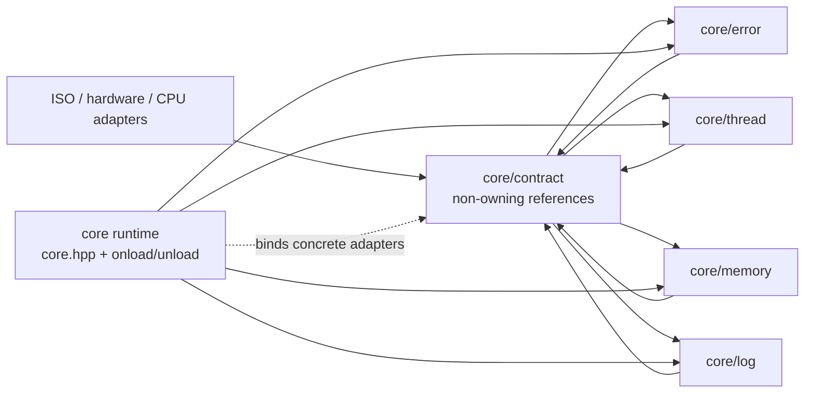
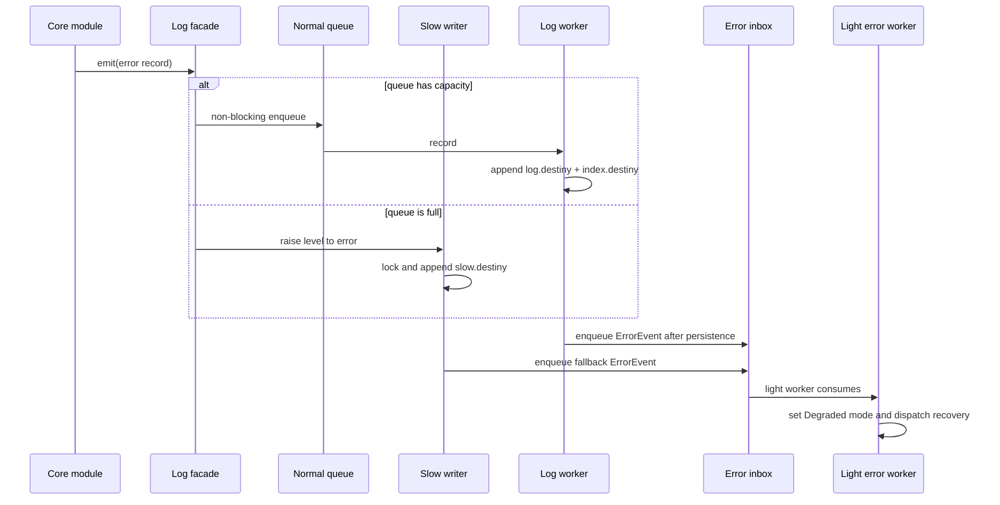
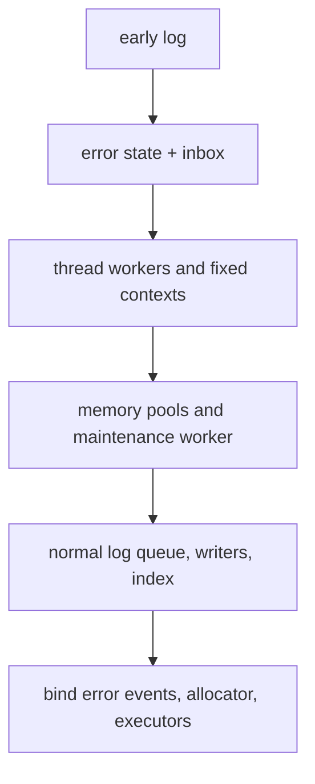
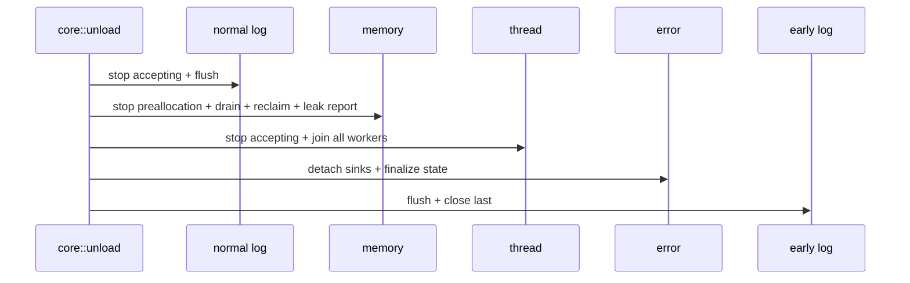

# Destiny Core Architecture

Chinese version: [ARCHITECTURE.zh-CN.md](./ARCHITECTURE.zh-CN.md)

Status: proposed architecture, ready for implementation in the order below.

`core` is layer 2 of the project. `basicType` is layer 1 and remains outside this design. The target is C++20 with Windows x86/x64 as the first implementation environment and Windows, Linux, and macOS as the platform abstraction set.

## 1. Constraints and decisions

- C++ exceptions are forbidden. Public core lifecycle uses `bool`; internal failures are recorded through the error and logging paths.
- Error codes are compile-time constants. A `DestinyCode` is two independent `uint32_t` values: `category` and category-local `code`.
- Logging has five levels: `trace`, `debug`, `info`, `warn`, and `error`.
- Normal logging is non-blocking. A full queue enters the slow lane and synchronously writes to `slow.destiny`.
- The early log path is available before the complete core is loaded and is the last service closed.
- Thread classes are semantic roles: `heavy`, `normal`, and `light`. No physical CPU affinity is exposed in the first implementation.
- The CPU topology adapter will later come from `code/ISO/hardware/CPU`; the thread module consumes topology information but does not discover it itself.
- Thread context slots are fixed at compile time and have named ownership. They are not a general-purpose external `thread_local` facility.
- Memory allocation modes are explicit: `owner_local`, `transferable`, and `shared`.
- A preallocation request returns an opaque token. If no slot is available, the request fails immediately; if the slot is not ready at redemption time, allocation falls back to the ordinary path.
- `core::onload()` and `core::unload()` own the complete runtime lifecycle. Configuration is compile-time policy for now, not a public `CoreConfig` object.

## 2. The dependency rule

The three feature modules must not depend on each other's concrete implementations. They communicate through small, non-owning contracts assembled by `core::onload()`.



The arrows are deliberately not `log -> memory -> thread -> log`. `log` receives an allocator and executor reference; `memory` receives an executor reference; `thread` receives an error/event sink. The runtime performs the wiring after each implementation is ready.

## 3. Internal module layout

### 3.1 `contract`

`contract` is header-only and contains only the seams needed to invert dependencies:

- `AllocatorRef`: allocate, release, and emergency reserve operations.
- `ExecutorRef`: submit a task to a thread class without exposing a concrete worker type.
- `ErrorSink`: accept a structured error event without formatting or allocation.
- `LogSink`: accept a log record or a slow-lane notification.
- `ThreadContextRef`: read the current destiny thread context and fixed slots.
- `FileSink`: append bytes and flush without knowing log format.

The references are non-owning. Ownership stays in the concrete module and in the runtime orchestrator.

### 3.2 `error`

`error` owns:

- the `DestinyCode` value type and compile-time code declarations;
- per-destiny-thread error state in a reserved fixed slot;
- the bounded `ErrorInbox`;
- the `Normal/Degraded` runtime mode;
- the error router and recovery policy dispatch.

`error` does not include the normal logger. It receives an `ErrorSink`/`LogSink` reference during runtime binding. This keeps error values usable during early startup and avoids a static dependency cycle.

### 3.3 `thread`

`thread` owns:

- the `destiny::Thread` handle and lifecycle state;
- worker creation, join, stop-accepting, and task submission;
- `heavy`, `normal`, and `light` semantic classes;
- fixed named context slots;
- the future topology adapter seam.

`heavy` tasks prefer performance-core capacity. If the reported topology cannot provide the requested capacity, the scheduler degrades `heavy -> normal -> light -> ordinary OS thread` according to the compile-time fallback policy. No physical core id is part of the public interface.

The error router and memory maintenance worker use separate `light` workers. Neither module creates a raw `std::thread` directly.

### 3.4 `memory`

`memory` owns:

- the fixed-size pool backend;
- the variable-size backend;
- the `Allocation` handle and allocation metadata;
- per-thread owner ledgers;
- explicit cross-thread release/access modes;
- preallocation slots and opaque tokens;
- the maintenance worker for preallocation, idle reclamation, and leak checks.

The maintenance worker is submitted through `ExecutorRef`. A per-thread mailbox is the handoff point for prepared blocks. A token is single-use and includes a generation so stale tokens cannot redeem a later request.

Bulk reclaim of a thread is a controlled operation, not an automatic consequence of `unload`:

- owner-local blocks can be reclaimed directly;
- transferable blocks must have completed ownership transfer;
- shared blocks with active leases are reported and are not silently freed.

### 3.5 `log`

`log` owns the record pipeline and storage, but not error policy:

- `record` builds a fixed-size structured record;
- `context` fills source location and current thread/task metadata;
- `queue` provides the non-blocking normal path;
- `early_writer` writes before full core startup;
- `slow_writer` writes queue-overflow records synchronously;
- `segment_writer` appends `log.destiny`;
- `index_writer` appends `index.destiny`;
- `recovery` validates a day directory and rebuilds the index from the data file;
- `log.hpp` remains a small façade.

The normal log worker persists a record before sending its error event to `error::ErrorInbox`. This is the required “record first, process second” order.

## 4. Automatic context with a short call

The public logging call should be small while the record remains rich:

```cpp
destiny::log::error(
    allocation_error,
    "fixed allocation failed",
    size,
    alignment);
```

The implementation captures `std::source_location::current()` through the default argument and reads the current fixed `ThreadContext`. The default context fields are:

- destiny thread id and logical name;
- `heavy/normal/light` class;
- current task id;
- current operation id, when an operation scope is active;
- error category and code;
- module-specific fields such as allocation size, alignment, pool id, and preallocation token.

Record construction uses an inline bounded buffer. The fast path must not allocate or depend on `std::format`; typed fields can be encoded with standard integer conversion utilities. A formatting failure is itself a structured error and follows the slow lane.

## 5. Error slow lane



The degraded mode is global and remains active until an explicit recovery policy clears it or the process restarts. Individual modules may additionally maintain local degraded state.

The error inbox has its own bounded non-blocking path. If it overflows, the event is written through the early/slow writer and counted; error processing must never block the log worker.

## 6. Destiny file format

File names are aliases. The durable identity is the 64-bit `DestinyCode` carried in the file and record headers.

Default daily layout:

```text
YYYY-MM-DD/
  log.destiny
  index.destiny
  slow.destiny
```

The first version should use fixed little-endian fields and a versioned header:

```text
FileHeader:
  uint64 magic            # fixed 8-byte destiny encoding
  uint64 file_code        # {category:uint32, code:uint32}
  uint32 format_version
  uint32 header_length

RecordHeader:
  uint64 record_code      # {category:uint32, code:uint32}
  uint64 payload_length
  uint32 flags
  uint32 crc32c
  payload bytes
```

`index.destiny` is an append-only map of record code and metadata to the byte offset in `log.destiny`. The data file is authoritative. If a process stops between the data append and the index append, `recovery` scans the last complete record and regenerates the missing index entries. A partial tail is truncated; a checksum mismatch is reported through the slow lane.

Responsibilities are intentionally split:

| Module | Owns | Does not own |
| --- | --- | --- |
| `day_directory` | date path and file discovery | record encoding |
| `file_format` | headers, fields, endian and checksum rules | file handles |
| `segment_writer` | append and flush of `log.destiny` | index reconstruction |
| `index_writer` | append of index entries | payload storage |
| `recovery` | validation, truncation, index rebuild | normal logging queue |
| `slow_writer` | locked emergency append | normal worker scheduling |

## 7. Lifecycle



`core::onload()` returns `bool`. It records the internal failure and rolls back already-started stages when any stage fails. No partially started module is left visible as a successful core.

Shutdown is deliberately two-phase:



Memory is the last resource manager to finish because it must reclaim allocations owned by other modules while their workers are still joinable. Early log is the final service because it is needed to report shutdown failures.

## 8. Proposed public seams

These are shape sketches, not final names:

```cpp
namespace destiny::core {
    bool onload() noexcept;
    void unload() noexcept;
}

namespace destiny::core::thread {
    enum class ThreadClass { heavy, normal, light };
    bool onload() noexcept;
    void unload() noexcept;
    Thread spawn(ThreadClass, Task, FallbackPolicy) noexcept;
    ThreadContext* current_context() noexcept;
}

namespace destiny::core::memory {
    Allocation allocate(Size, Alignment, AllocationMode) noexcept;
    PreallocationToken preallocate(Size, Alignment, AllocationMode) noexcept;
    Allocation allocate_from(PreallocationToken) noexcept;
    void release(Allocation) noexcept;
}

namespace destiny::core::log {
    void write(Level, DestinyCode, MessageView,
               std::source_location = std::source_location::current()) noexcept;
}
```

Concrete public names can change during implementation; the dependency and lifecycle rules should not.

## 9. Implementation order

### Phase 0: contracts and format

- Add the internal contract headers and `core/error` value types.
- Define compile-time categories and codes.
- Define `DestinyCode`, file headers, record headers, and recovery invariants.
- Correct the thread CMake include target typo.

### Phase 1: early log and platform seams

- Implement the locked early writer and daily directory adapter.
- Add file, virtual-memory, OS-thread, and CPU-topology adapter interfaces.
- Test append, flush, partial-tail detection, and three-platform compile seams.

### Phase 2: thread context and scheduler

- Implement fixed named slots and context lifecycle.
- Implement `heavy/normal/light` workers without physical affinity.
- Implement fallback and two-phase stop/join.

### Phase 3: error state and slow lane

- Implement `ErrorInbox`, global degraded mode, and the dedicated light error worker.
- Verify record-before-process ordering and inbox overflow fallback.

### Phase 4: memory

- Implement allocation handles, fixed pools, variable backend, owner ledgers, and explicit modes.
- Implement preallocation slots and ordinary-allocation fallback.
- Add maintenance-worker reclaim and leak reporting.

### Phase 5: normal log and index

- Implement bounded non-blocking queue and slow writer.
- Implement segment writer, index writer, and recovery as separate modules.
- Add automatic source/thread/task context.

### Phase 6: runtime integration

- Implement `core::onload/unload` and rollback.
- Bind concrete allocator, executor, error, log, and file adapters.
- Run shutdown under allocation pressure and injected failures.

### Phase 7: hardening

- Windows x86/x64 debug and release builds.
- Linux/macOS adapter builds.
- Concurrent stress, crash/recovery, leak, stale-token, and degraded-mode tests.
- Benchmark normal path, slow lane, fixed allocation, and preallocation hit/miss.

## 10. Acceptance reference

### Architecture and build

- No core module includes another module's concrete implementation header.
- `core::onload()` returns only `bool` and leaves no partially initialized runtime after failure.
- `core::unload()` is idempotent and closes early log last.
- No `throw`, `catch`, or C++ `thread_local` appears under `code/core`.
- Thread CMake targets and include directories resolve independently.

### Thread

- Fixed slots are compile-time defined and named.
- `heavy`, `normal`, and `light` submission works without physical affinity.
- Heavy fallback is deterministic when topology information is absent or insufficient.
- Error and memory maintenance use separate light workers.
- Stop-accepting, drain, and final join are observable in tests.

### Memory

- Fixed-size and variable-size allocations are custom backends.
- Allocation handles reject stale generation and double release.
- Owner-local, transferable, and shared modes are explicit.
- Preallocation slot exhaustion returns an invalid token immediately.
- A not-yet-ready token falls back to ordinary allocation.
- Bulk owner reclaim reports active transferable/shared ownership instead of silently corrupting it.
- Leak checks run before thread join completes.

### Log and error

- The normal queue never blocks its producer.
- Queue overflow writes `slow.destiny` and preserves the error event.
- Records are persisted before error recovery is dispatched.
- Source location and destiny thread context are present in a short-call record.
- Daily files have valid magic, code, length, version, and checksum fields.
- A truncated or damaged tail is detected; the data file can rebuild its index.
- Error inbox overflow is counted and follows the early/slow path.

Set numeric latency and throughput thresholds only after Phase 5 establishes a Windows baseline; the architecture should not invent performance numbers before measuring the real allocator and queue.

## 11. Git and GitHub backup nodes

Use a dedicated branch such as `codex/core-architecture`. Keep commits small enough that each node can be restored independently:

1. `docs(core): record vocabulary and architecture` — `CONTEXT.md`, this document, and the initial Mermaid diagrams.
2. `build(core): add contract and error targets` — CMake target graph and fixed include-directory typo.
3. `feat(core): add early log and file format` — format, writer, recovery tests.
4. `feat(core): add destiny thread context` — slots, worker classes, lifecycle tests.
5. `feat(core): add error slow lane` — inbox, degraded mode, ordering tests.
6. `feat(core): add custom memory backends` — handles, owner ledger, preallocation, maintenance tests.
7. `feat(core): integrate runtime lifecycle` — `core::onload/unload`, rollback, shutdown tests.
8. `test(core): add stress and crash recovery coverage` — cross-thread, corruption, leak, and performance baselines.

Recommended GitHub backup points:

- Tag `core-architecture-v0` after node 1.
- Tag `core-contracts-v0` after node 2.
- Tag `core-runtime-alpha` after node 7.
- Tag `core-runtime-rc1` after node 8 and the Windows matrix is green.

Push each tag and its commit to the remote before starting the next phase. Do not combine a format change, allocator change, and scheduler change in one backup commit; those are the three hardest decisions to revert independently.
