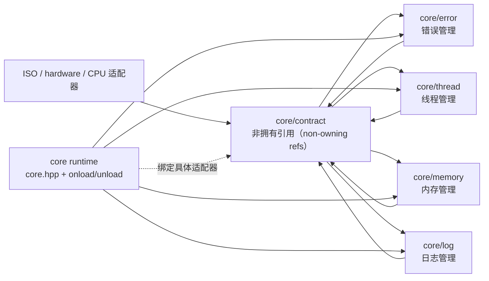
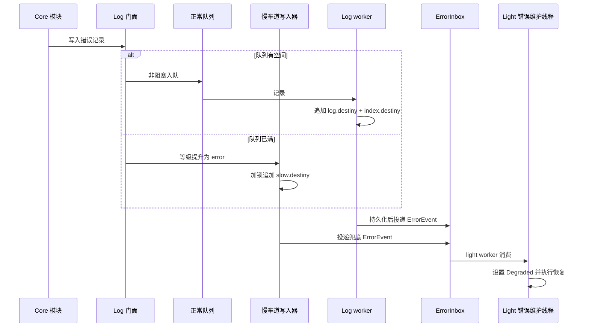
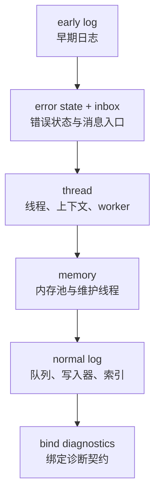
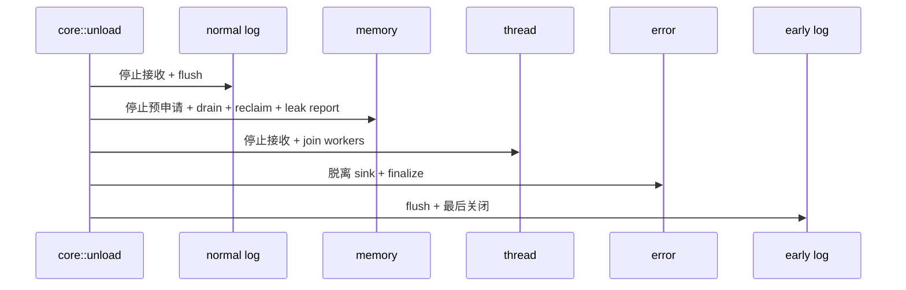

# Destiny Core 架构设计

状态：架构已确认，可按本文的顺序开工。英文原版见 [ARCHITECTURE.md](./ARCHITECTURE.md)。

`core` 是项目的第二层运行时基础，`basicType` 是第一层且不在本文范围内。首个实现目标是 Windows x86/x64；平台抽象覆盖 Windows、Linux 和 macOS。代码使用 C++20，但不使用 C++ 异常。

## 1. 约束与已确认决策

- 项目杜绝 C++ 异常。`core::onload()` 只返回 `bool`；内部失败通过错误状态、早期日志和正常日志保存。
- 错误码由编译期常量组成。`DestinyCode` 是两个独立的 `uint32_t`：`category` 和类别内 `code`。
- 日志级别固定为 `trace`（追踪）、`debug`（调试）、`info`（信息）、`warn`（警告）和 `error`（错误）。
- 正常日志路径非阻塞。队列满时进入慢车道，并加锁追加到 `slow.destiny`。
- 早期日志（early log）在完整 core 启动前可用，且最后关闭。
- 线程类别使用 `heavy`、`normal`、`light`，第一版不暴露物理核心绑定。
- CPU 拓扑由未来的 `code/ISO/hardware/CPU` 适配器提供，thread 模块只消费拓扑结果。
- 线程上下文槽位编译期固定、名称固定，不提供外部任意声明的 `thread_local`。
- 内存生命周期必须显式选择 `owner_local`、`transferable` 或 `shared`。
- 预申请返回不透明句柄。槽位不足立即失败；兑现时槽位尚未准备好则降级为普通申请。
- `core::onload()` 和 `core::unload()` 统一管理整个 core 生命周期；当前配置以宏和编译期策略固定，不引入 `CoreConfig`。

## 2. 依赖规则：用契约层打断环

三个功能模块不直接依赖彼此的具体实现，而是通过内部契约层（contract seam，契约接缝）通信，由 `core::onload()` 在运行时装配具体对象。



禁止形成 `log -> memory -> thread -> log` 的静态依赖环：

- log 接收 `AllocatorRef`（分配器引用）和 `ExecutorRef`（执行器引用）；
- memory 接收 `ExecutorRef`，但不创建原生线程；
- thread 接收错误/事件 sink（接收端），但不 include 正常日志实现；
- runtime 拥有具体实现，并在各模块启动后绑定这些引用。

## 3. 内部模块结构

### 3.1 `contract`：内部契约层

这是 header-only（仅头文件）模块，只放依赖反转所需的最小接口：

- `AllocatorRef`：普通分配、释放和紧急保留；
- `ExecutorRef`：向指定线程类别提交任务；
- `ErrorSink`：接收结构化错误事件，不负责格式化和分配；
- `LogSink`：接收日志记录或慢车道通知；
- `ThreadContextRef`：读取当前 Destiny 线程上下文和固定槽位；
- `FileSink`：追加字节并 flush（刷盘），但不理解日志格式。

这些引用是 non-owning（非拥有）的；对象所有权仍由具体模块和 runtime 持有。

### 3.2 `error`：错误管理

`error` 负责：

- `DestinyCode` 和编译期错误码声明；
- 存放在 Destiny 线程固定槽位中的错误状态；
- 有界 `ErrorInbox`（错误消息入口）；
- `Normal/Degraded`（正常/降级）运行模式；
- 错误路由器和恢复策略分派。

`error` 不 include 正常 logger。启动早期绑定 early log，完整日志启动后再绑定 normal log，从而避免静态依赖环。

### 3.3 `thread`：线程管理

`thread` 负责：

- `destiny::Thread` 句柄和生命周期；
- worker 创建、停止接收、join（汇合）和任务提交；
- `heavy`、`normal`、`light` 三种语义类别；
- 编译期固定的命名线程槽位；
- 未来 CPU 拓扑适配器的接缝。

`heavy` 表示性能敏感工作，优先映射到性能核容量；拓扑不足时按 `heavy -> normal -> light -> 普通 OS 线程` 降级。第一版不暴露物理 core id，也不强制 affinity（亲和性）。

错误路由器和内存维护各自申请独立的 `light` worker，任何模块都不直接创建裸 `std::thread`。

### 3.4 `memory`：内存管理

`memory` 负责：

- 固定大小内存池和变长分配后端；
- `Allocation`（分配句柄）及其元数据；
- 每个线程的所有者账本（owner ledger）；
- 显式的跨线程释放/访问模式；
- 预申请槽位和不透明 token；
- 负责预申请、空闲回收和泄露检查的维护 worker。

维护 worker 通过 `ExecutorRef` 提交，并把准备好的块放入对应线程 mailbox（邮箱）。token 单次使用并携带 generation（代次），防止旧句柄兑现新请求。

强制回收某个线程的内存必须经过受控流程：owner-local 可直接回收；transferable 必须完成所有权转移；shared 仍有活动 lease（租约）时只能报告错误，不得静默释放。

### 3.5 `log`：日志管理

`log` 负责日志记录、队列和持久化，但不拥有错误恢复策略：

- `record`：构造有界结构化记录；
- `context`：补齐调用位置、线程和任务上下文；
- `queue`：正常非阻塞路径；
- `early_writer`：core 启动前写入；
- `slow_writer`：队列满时加锁追加；
- `segment_writer`：追加 `log.destiny`；
- `index_writer`：追加 `index.destiny`；
- `recovery`：验证日目录并从数据文件重建索引；
- `log.hpp`：保持小型 façade（门面）。

日志 worker 必须先持久化记录，再向 `error::ErrorInbox` 投递错误事件，严格实现“先记录、后处理”。

## 4. 短调用与自动上下文

调用者只写简短调用：

```cpp
destiny::log::error(
    allocation_error,
    "fixed allocation failed",
    size,
    alignment);
```

实现通过 `std::source_location::current()` 自动捕获调用位置，并从固定 `ThreadContext` 读取：

- Destiny 线程 id 和逻辑名称；
- `heavy/normal/light` 类别；
- 当前任务 id；
- 当前 operation id（操作 id）；
- category/code 错误码；
- 分配大小、对齐、内存池 id 和预申请 token 等模块字段。

记录使用 inline bounded buffer（内联有界缓冲区），快速路径不得再次申请内存，也不依赖 `std::format`。格式化失败本身也必须成为结构化错误并进入慢车道。

## 5. 错误慢车道（slow lane）



降级状态是全局状态，直到显式恢复策略清除或进程重启才退出；模块还可以拥有自己的局部降级状态。错误处理不能阻塞 log worker，恢复中的慢操作必须由独立的 light worker 承担。

## 6. Destiny 文件格式

文件名只是可读别名，真正的持久身份是文件头和记录头中的 64 位 `DestinyCode`。

```text
YYYY-MM-DD/
  log.destiny
  index.destiny
  slow.destiny
```

第一版使用固定 little-endian（小端）和版本化文件头：

```text
FileHeader:
  uint64 magic            # 固定 8 字节 destiny 编码
  uint64 file_code        # {category:uint32, code:uint32}
  uint32 format_version
  uint32 header_length

RecordHeader:
  uint64 record_code      # {category:uint32, code:uint32}
  uint64 payload_length
  uint32 flags
  uint32 crc32c
  payload bytes
```

`index.destiny` 是记录编码和元数据到 `log.destiny` 字节偏移的 append-only（只追加）映射。数据文件是真实来源；如果数据追加成功而索引追加失败，`recovery` 扫描最后一条完整记录并重建缺失索引。尾部不完整就截断，checksum（校验和）错误则进入慢车道。

文件职责拆分如下：

| 模块 | 负责 | 不负责 |
| --- | --- | --- |
| `day_directory` | 日期目录和文件发现 | 记录编码 |
| `file_format` | 文件头、字段、端序和校验规则 | 文件句柄 |
| `segment_writer` | 追加和 flush `log.destiny` | 索引重建 |
| `index_writer` | 追加索引项 | 负载存储 |
| `recovery` | 校验、截断和索引重建 | 正常日志队列 |
| `slow_writer` | 加锁紧急追加 | worker 调度 |

## 7. 生命周期



`core::onload()` 只返回 `bool`。任一阶段失败时记录内部错误，并按反序回滚已启动阶段，不得留下看似成功但不完整的 runtime。

关闭采用两阶段：



内存必须在 worker 仍可 join 时完成排空和回收，因此它是资源管理器中最后完成的模块；early log 是整个 core 最后关闭的服务。

## 8. 公共接口形状（草图）

```cpp
namespace destiny::core {
    bool onload() noexcept;
    void unload() noexcept;
}

namespace destiny::core::thread {
    enum class ThreadClass { heavy, normal, light };
    bool onload() noexcept;
    void unload() noexcept;
    Thread spawn(ThreadClass, Task, FallbackPolicy) noexcept;
    ThreadContext* current_context() noexcept;
}

namespace destiny::core::memory {
    Allocation allocate(Size, Alignment, AllocationMode) noexcept;
    PreallocationToken preallocate(Size, Alignment, AllocationMode) noexcept;
    Allocation allocate_from(PreallocationToken) noexcept;
    void release(Allocation) noexcept;
}

namespace destiny::core::log {
    void write(Level, DestinyCode, MessageView,
               std::source_location = std::source_location::current()) noexcept;
}
```

具体函数名可以在实现时调整，但依赖方向和生命周期约束不能改变。

## 9. 开工顺序参考

### Phase 0：契约与文件格式

- 增加内部 contract 头文件和 `core/error` 值类型；
- 固定错误 category/code 常量；
- 固定 `DestinyCode`、文件头、记录头和恢复不变量；
- 修正 thread CMake 文件中的 include target 名称错误。

### Phase 1：早期日志与平台接缝

- 实现加锁 early writer 和日期目录；
- 增加文件、虚拟内存、OS 线程和 CPU 拓扑适配器接口；
- 测试追加、flush、尾部不完整检测和三平台编译接缝。

### Phase 2：线程上下文与调度器

- 实现固定命名槽位和上下文生命周期；
- 实现无物理亲和性的 `heavy/normal/light` worker；
- 实现降级、停止接收和两阶段 join。

### Phase 3：错误状态与慢车道

- 实现 `ErrorInbox`、全局 Degraded 状态和独立 light 错误线程；
- 验证“持久化先于处理”和 inbox 溢出兜底。

### Phase 4：内存系统

- 实现分配句柄、固定池、变长后端、所有者账本和显式模式；
- 实现预申请槽位和普通申请降级；
- 增加维护线程回收、泄露检查和按线程强制回收。

### Phase 5：正常日志与索引

- 实现有界非阻塞队列和慢车道写入器；
- 分离实现 segment writer、index writer 和 recovery；
- 增加 source/thread/task 自动上下文。

### Phase 6：runtime 集成

- 实现 `core::onload/unload` 和反序回滚；
- 绑定 allocator、executor、error、log 和 file 适配器；
- 在内存压力和注入故障下测试关闭。

### Phase 7：强化

- Windows x86/x64 debug/release 构建；
- Linux/macOS 适配器构建；
- 并发压力、崩溃恢复、泄露、旧 token、降级模式和性能基线测试。

## 10. 验收参考

### 架构和构建

- core 模块不 include 其他模块的具体实现头文件；
- `core::onload()` 只返回 `bool`，失败后没有半初始化 runtime；
- `core::unload()` 可重复调用，early log 最后关闭；
- `code/core` 中没有 `throw`、`catch` 或 C++ `thread_local`；
- thread 的 CMake target 和 include directory 独立正确。

### 线程

- 槽位编译期固定且名称固定；
- 三种线程类别在无物理亲和性时可工作；
- heavy 在拓扑缺失或容量不足时降级确定；
- 错误维护和内存维护使用不同的 light worker；
- 停止接收、排空和最终 join 可被测试观测。

### 内存

- 固定大小和变长申请均使用自定义后端；
- 分配句柄能拒绝旧 generation 和重复释放；
- owner-local、transferable、shared 是显式模式；
- 预申请槽位不足立即返回无效 token；
- token 未准备好时能降级为普通申请；
- 强制回收能报告仍活跃的 transferable/shared 所有权，而不是静默破坏。

### 日志和错误

- 正常队列不会阻塞生产者；
- 队列满时写入 `slow.destiny` 并保留错误事件；
- 日志持久化发生在错误恢复分派之前；
- 简短调用中存在 source location 和 Destiny 线程上下文；
- 日文件具备 magic、code、length、version 和 checksum；
- 尾部损坏可检测，数据文件能够重建索引；
- ErrorInbox 溢出有计数并进入 early/slow 路径。

性能阈值应在 Phase 5 之后用 Windows 实测基线确定，不在架构阶段虚构固定数字。

## 11. Git / GitHub 备份节点参考

建议使用 `codex/core-architecture` 分支，并让每个节点可独立恢复：

1. `docs(core): record architecture zh-cn`：中文、英文架构文档和术语表；
2. `build(core): add contract and error targets`：契约层、错误目标和 CMake 修正；
3. `feat(core): add early log and file format`：格式、写入、恢复测试；
4. `feat(core): add destiny thread context`：槽位、线程类别和生命周期测试；
5. `feat(core): add error slow lane`：inbox、降级状态和顺序测试；
6. `feat(core): add custom memory backends`：句柄、所有者账本、预申请和维护测试；
7. `feat(core): integrate runtime lifecycle`：`onload/unload`、回滚和关闭测试；
8. `test(core): add stress and crash recovery coverage`：并发、损坏、泄露和性能基线。

建议标签：`core-architecture-v0`、`core-contracts-v0`、`core-runtime-alpha`、`core-runtime-rc1`。格式、分配器和调度器不要合并在同一个备份提交中，便于单独回退。
