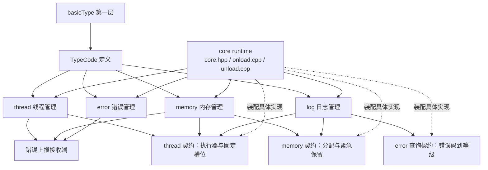
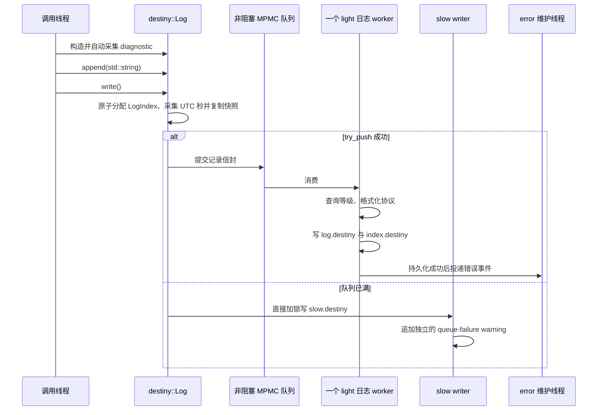

# Destiny Core 架构

本文是 `code/core` 的中文架构基线。`core` 位于 `basicType` 之上，是项目的第二层运行时基础。本文只确定模块职责、依赖方向、生命周期、数据协议和验收条件，不改变现有源码。

配套文件：[`log/INTERFACE.zh-CN.md`](./log/INTERFACE.zh-CN.md)、[`plan.md`](./plan.md) 和 [`ARCHITECTURE.html`](./ARCHITECTURE.html)。

首个验证平台是 Windows；平台接缝同时覆盖 Windows、Linux 和 macOS。实现使用 C++ 标准能力和 C++20，项目禁止 C++ 异常，所有失败都通过返回值、状态和日志处理。

## 1. 设计目标

`core` 需要在底层故障发生时继续维持结构完整，因此三个核心模块必须满足四条原则：

1. 对外接口小而深。调用者只知道稳定的类型和契约，队列、文件、线程和回收策略留在模块实现中。
2. 依赖通过契约接缝反转。`log`、`memory`、`thread` 不互相 include 对方的具体实现头文件。
3. 错误先记录、后处理。记录失败也必须有慢车道；慢车道失败才触发 core 的最终卸载策略。
4. 所有可持久化身份都使用 `TypeCode`。文件、记录、错误、区段和未来的数据类型都以 64 位编码表达。

当前不引入 `CoreConfig`。容量、槽位数、队列大小和平台策略使用宏或编译期常量固定，待实测后再改变。

## 2. 统一身份：TypeCode

`TypeCode` 在 `code/define/typeCode.hpp` 定义，是整个 Destiny 文件和运行时协议的共同词汇。它在逻辑上由两个 `uint32_t` 组成：

```text
TypeCode = [category:uint32][value:uint32]
磁盘编码 = uint64
高 32 位 = category
低 32 位 = value
```

`errorCode` 不是另一种编码，而是 `TypeCode` 在错误领域的语义。错误码由 `error` 模块定义为常量；日志、文件格式和索引只保存这个 64 位编码，不复制一套错误码表。

TypeCode 的使用范围包括：

- 文件类型：`log.destiny`、`index.destiny`、`slow.destiny`；
- 记录类型和区段类型；
- 错误类别与类别内编号；
- 数据类型、未来的索引类型和扩展类型。

公共接口接收一个 `uint64_t` 编码并在内部拆成两个 `uint32_t`。具体错误类别数值暂不冻结，但所有常量必须集中在 `error` 模块，不能散落在调用方。

## 3. 模块关系与契约接缝

### 3.1 依赖图



图中的契约是 `core` 内部的 header-only 接缝，建议放在 `code/core/detail/contract`。它们只描述调用所需的最小行为，不拥有对象，也不包含文件流、锁、线程句柄或池实现。

### 3.2 允许和禁止的依赖

| 模块 | 可以依赖 | 不可以依赖 |
| --- | --- | --- |
| `error` | `basicType`、`TypeCode`、错误状态契约 | `log` 的具体实现、文件写入器 |
| `thread` | 执行器契约、错误上报接收端、平台线程适配器 | `log.hpp`、内存池实现 |
| `memory` | 分配契约、线程执行器、错误上报接收端、平台内存适配器 | `log.hpp`、裸 `std::thread` |
| `diagnostic` | thread 固定槽位、memory 分配契约 | `log`、日志队列、日志文件 |
| `log` | `TypeCode`、错误等级查询契约、memory 分配契约、thread 上下文快照 | `error` 的恢复实现、裸文件和线程的公共暴露 |
| `core runtime` | 所有模块的 onload/unload 和契约实现 | 让调用方自行装配生命周期 |

这样打断了 `log -> memory -> thread -> log` 的静态环。模块之间仍然可以协作，但协作发生在 runtime 装配的接缝上，而不是在头文件中形成循环 include。

### 3.3 契约最小形状

具体命名可以在实现阶段调整，语义不可改变：

- `AllocatorPort`：分配、释放、紧急保留和记录池申请；
- `ExecutorPort`：按 `heavy`、`normal`、`light` 提交任务；
- `ThreadContextPort`：读取当前 Destiny 线程和编译期固定槽位；
- `ErrorSinkPort`：接收结构化错误事件，不做格式化；
- `ErrorLevelQueryPort`：用有符号结果把 `TypeCode` 查询为 `0..4` 或 `-1`；等级常量本身仍是 `uint8_t`；
- `FileAppendPort`：追加字节、刷新和报告偏移，不理解日志字段。

所有 port 都是 non-owning（非拥有）引用。对象所有权只由具体模块的 runtime 持有，避免一个模块在错误路径析构另一个模块。

## 4. 四个功能模块

### 4.1 `error`：错误管理

`error` 是独立模块，不是异常系统。它提供：

- `TypeCode` 语义下的编译期错误码常量；
- 错误码到日志等级的查询头文件，供 `log` 的维护线程使用；
- 错误状态、错误事件和慢车道状态；
- 诊断未知错误码、队列故障和持久化故障的协议；
- 后续可扩展的日志查询接缝。v0 暂不实现完整查询接口，索引格式先为查询保留数据。

日志查询相关声明集中在 `error` 的一个独立头文件（文件名待实现阶段确定），`log` 不复制查询协议。该头文件只提供维护线程需要的隐藏查询函数，并为未来按 `TypeCode`、时间和等级查询索引预留位置；v0 不把查询方法放进 `destiny::Log`。

等级常量用内部 `uint8_t` 表示 `0..4`；查询函数使用有符号返回值，未知码返回 `-1`。error 只负责报告未知码，提升为 warning 和写入 slow lane 由 `log` 执行。未知码是代码逻辑错误，但不能让程序崩溃。

`error` 不反向调用 `log`。日志记录持久化成功后，worker 通过 `ErrorSinkPort` 投递事件；错误维护线程再决定状态更新和恢复动作。

### 4.2 `thread`：线程管理

`thread` 提供公开的 `destiny::Thread` 类型和线程申请接口，负责：

- 从系统创建、停止接收、排空并汇合 worker；
- 管理 `heavy`、`normal`、`light` 三种语义类别；
- 提供编译期确定、名称固定的线程上下文槽位；
- 向其他模块提供 `void*` 槽位，使模块自行把它解释为自己的上下文类型；
- 接入未来的 CPU 拓扑适配器。

固定槽位是项目对 `thread_local` 的替代方案：平台上的 `thread_local` 访问延迟在本项目目标环境中不可接受，因此 thread 只提供预先写死的槽位名字和布局，不开放外部动态注册。

`heavy` 接口在语义上至少提供 8 个性能线程并优先占用性能核；实际性能核容量不足时按 `heavy -> normal -> light -> 普通系统线程` 逐级降级。`normal` 和 `light` 暂不绑定物理核心，只根据可用线程动态调配。第一版不暴露核心 id，也不把 affinity（亲和性）写死在接口中。

CPU 数量和 P/E 核信息由未来的 `code/ISO/hardware/CPU` 组件提供，thread 只消费结果。错误通过 `ErrorSinkPort` 上报，不直接 include `log.hpp`。

### 4.3 `memory`：内存管理

`memory` 接收项目全部内存申请和释放，提供两个后端：

- 固定大小块：池化、批量补充、快速 free-list；
- 不定大小块：带对齐和容量元数据的通用分配。

两条路径都使用项目自定义分配器，并在多线程下保持原子化。平台差异收敛在三端适配器中：Windows、Linux、macOS；当前只要求 Windows 测试通过。

对外返回 `Allocation` 句柄，而不是裸指针。句柄隐藏 owner、generation、大小、对齐、池 id 和释放路径，帮助快速释放并拒绝旧句柄、重复释放和错误线程操作。

默认协议是“谁申请、谁释放、谁访问”。需要跨线程时必须显式选择模式：

- `owner_local`：申请、访问、释放都由同一线程完成；
- `transferable`：所有权可以转移，由新 owner 释放；
- `shared`：申请线程负责最终释放，其他线程通过受控访问契约使用。

维护线程由 thread 申请一个独立的 `light` worker，职责是：

1. 消费预申请请求，把准备好的块挂载到对应线程的预申请槽位；
2. 回收空闲内存；
3. 检查泄露、generation 和所有权账本。

预申请返回外部不可见的 token，内部包含槽位 id 和 generation。槽位不足时立即返回 id 为 `-1` 的无效 token；兑现时若维护线程尚未准备好，工作线程立即降级为普通申请。维护线程只能通过契约操作内存，不得直接控制调用方对象。

### 4.4 `diagnostic`：上下文采集

`diagnostic` 是独立目录 `code/core/diagnostic`，取代仅在调试构建中工作的旧 `debug` 命名。发行版采集错误系统所需的最低信息，调试构建可以追加函数运行信息、线程任务信息和其他诊断字段。

它依赖 thread 提供的固定 `diagnostic_context` 槽位和 memory 的分配契约，但不依赖 log、不创建线程，也不拥有日志生命周期。`Log` 无参构造时调用 diagnostic，得到一份诊断字符串；之后调用者才能追加用户字符串。

diagnostic 与 user 数据不靠可被误解析的前缀区分，也不使用 JSON。Log 在提交时根据长度格式化成二进制区段，读取器只解析 diagnostic 长度，user 区段按原始字节复制。

## 5. `log` 的职责和公共接口

对外唯一的记录类型是 `destiny::Log`。它是一次日志对象（可移动的 builder value），只负责保存一条记录并在 `write()` 时提交；它不拥有队列、worker、文件或错误恢复状态。

```cpp
namespace destiny {
class Log {
public:
    Log() noexcept;
    Log(Log&&) noexcept;
    Log& operator=(Log&&) noexcept;
    ~Log() noexcept;

    void setErrorCode(std::uint64_t code) noexcept;
    void append(const std::string& text) noexcept;
    void write() noexcept;
};
}
```

接口不公开等级、日志序号、payload、队列结果和文件路径，也不接受构造参数，不支持链式调用。`setErrorCode()` 可以多次调用，最后一次生效；默认 TypeCode 必须是非 `0,0` 的未知码。`append()` 可以调用多次，空字符串合法，内容复制进 Log 自己的存储。Log 允许移动，不承诺并发修改；复制被禁止。移动后源对象不再产生有效写入。

日志等级不由调用者传入。`log` 的维护线程收到记录后调用 `error` 的等级查询：

```text
detail::level = 0 trace（追踪）
detail::level = 1 debug（调试级别）
detail::level = 2 info（信息）
detail::level = 3 warn（警告）
detail::level = 4 error（错误）
未知查询 = -1
```

这些等级值是 `destiny::detail` 中的 `uint8_t` 常量，不使用公共枚举；查询结果用有符号值承载 `-1`。未知码先按 warning 写入原始 Log 数据，再由维护线程生成一个包含完整原始 Log 数据副本的 unknown-code warning。这个新 warning 先尝试进入正常队列；若队列满，先把 unknown-code warning 写入 `slow.destiny`，成功后再追加 queue-failure warning。每个新增 warning 都直接包含相关原始 Log 快照，不保存引用，便于后续修改和独立持久化。

## 6. Log 的写入路径

正常队列是非阻塞 MPMC。生产者只调用 `try_push`：



队列固定一个 `light` worker。MPMC 允许未来增加消费者，但 v0 不增加；这样日志写入的串行文件顺序和 recovery 规则更容易验证。

`write()` 对外返回 `void`，因为调用方无法处理日志内部失败。正常队列失败不会等待；原始记录立即进入慢车道，同时新增一条描述队列故障的 warning。原始记录的错误码和等级不被修改。慢车道与早期 writer 使用同一行为：加锁、直接写 `slow.destiny`，不建立 `early.destiny`。slow writer 几乎不应失败；若确实失败，先尝试写入一条最小 error 记录，随后保存无分配的失败状态并触发 `core::unload()`，不得继续使用可能损坏的日志运行时。

内存系统动态扩容或记录信封申请失败也进入慢车道。慢车道不得再次依赖普通动态分配，应使用预留缓冲区或平台直接写入。

## 7. Destiny 文件和记录协议

日期目录使用 UTC 日期，目录名为 `YYYY-MM-DD`。每个日期目录有三个文件：

```text
YYYY-MM-DD/
  log.destiny
  index.destiny
  slow.destiny
```

文件名只是可读别名，唯一身份由 TypeCode 表达。每个文件开头固定为两个 64 位字段：

```text
[magic:uint64]       # 写入“destiny”的固定 64 位 magic
[fileTypeCode:uint64]
```

`fileTypeCode` 仍按 TypeCode 拆分：高 32 位是文件类别，低 32 位区分该类别下的具体文件；三种文件的具体数值留给 `define/typeCode.hpp` 和 error/format 阶段冻结。

除固定布局的 `index.destiny` 槽位外，所有记录遵循 `[uint64 编码][uint64 长度][属于该编码的数据]` 的原则。v0 使用固定 little-endian（小端），不增加未经确认的版本号、校验和或额外头字段；未来扩展通过新的 TypeCode 表达。

### 7.1 `log.destiny` 和 `slow.destiny`

正常记录和慢车道记录采用同一记录结构；`slow.destiny` 不进入索引：

```text
[DestinyRecordCode:uint64] # 本条记录的 TypeCode；错误日志中承载 errorCode
[recordLength:uint64]

[LogIndex:uint64]       # 逻辑类型 uint32_t，低 32 位有效，磁盘固定 8 字节
[errorTime:uint64]      # write() 时采集的 UTC Unix 秒

[sectionType:uint64]
[sectionLength:uint64]
[diagnosticLen:uint64]
[userLen:uint64]
[diagnostic bytes]
[user bytes]
```

`sectionType` 是 TypeCode；v0 只需要一个固定的 Log 文本区段类型，具体 category/value 不在架构阶段确定。

长度的定义固定为“该长度字段之后的字节数”：

```text
sectionLength = 16 + diagnosticLen + userLen
recordLength  = 16 + 16 + sectionLength
```

`recordLength` 覆盖 LogIndex、errorTime、sectionType、sectionLength 以及区段内容；`sectionLength` 覆盖 diagnosticLen、userLen 和两段文本。实现必须按长度跳过未知的未来字段，而不是猜测 user 文本的语义。

`LogIndex` 是进程内从 0 开始、写入时原子分配的单调逻辑序号。序号出现空洞只表示对应日志丢失，不承担诊断序号职责；回绕不是预期行为，也不能让进程崩溃，未来解析器再处理回绕。

`diagnostic` 和 `user` 都是 UTF-8 短文本的字节串。空文本合法；v0 不验证 UTF-8，不解析 user 内容，只按长度复制。Log 平时分别保存两段 `std::string`，提交时一次性格式化为上述区段。

### 7.2 `index.destiny`

索引只指向 `log.destiny`，每个索引项固定 8 个 64 位槽位，即 64 字节：

```text
slot[0] LogIndex       # 低 32 位有效
slot[1] errorTime      # UTC Unix 秒
slot[2] level          # 低 8 位有效，0..4；其余位为 0
slot[3] logOffset      # log.destiny 中记录起始偏移
slot[4] recordLength   # 对应记录的 recordLength 字段值，不包含 16 字节记录头
slot[5] reserved0      # 扩展槽
slot[6] reserved1      # 扩展槽
slot[7] reserved2      # 扩展槽
```

三个保留槽用于后续诊断开发；v0 写零，不改变索引项大小。index 项是由文件头和固定 64 字节大小识别的布局例外，不再包一层额外的 TypeCode/长度头。索引提供序号、时间和等级的快速筛选，完整错误码和文本仍以 `log.destiny` 为准。第一版不实现查询接口，`error` 头文件只预留查询接缝。

### 7.3 启动恢复

日期目录启动时由独立的 `day_directory`、`file_format`、`recovery` 模块协作，避免一个文件承载发现、解析、校验、重建和写入的全部职责：

1. 检查三个文件的 magic 和 fileTypeCode；缺失文件按可创建的空文件处理。
2. 从最后一个完整 `recordLength` 边界扫描 `log.destiny`；尾部不完整时只截断尾部，不修改前面的记录。
3. 校验 `index.destiny` 的 64 字节对齐、偏移、长度和序号单调性；损坏或缺失时依据 `log.destiny` 重建。
4. `slow.destiny` 只做结构完整性检查，不尝试写入 index。

恢复模块只处理字节结构和文件状态，不查询错误等级，也不执行错误恢复。

## 8. 启动、关闭和所有权

### 8.1 启动

`code/core/core.hpp`、`onload.cpp` 和 `unload.cpp` 负责整个 core 的生命周期。`core::onload()` 只返回 `bool`，不把内部 ErrorCode 暴露给无法处理它的外部调用方。

启动顺序：

1. 启动 log 的 early writer：获取 UTC 日期目录，准备加锁写入 `slow.destiny`；此时不依赖 memory、thread 或完整 error。
2. 装载 `error` 的常量表、等级查询和错误状态。
3. 启动 `thread`，建立固定槽位和执行器契约。
4. 启动 `memory`，建立固定池、变长后端和独立维护 light worker。
5. 启动正常 `log`：创建非阻塞 MPMC 队列、一个 light worker、segment writer、index writer 和 recovery。
6. 绑定 diagnostic：让 Log 构造可以从 thread 槽位和 memory 契约采集上下文。

任一阶段失败都先经 early/slow writer 记录，再按反序撤销已完成绑定，最后返回 `false`。不能留下半初始化、对外看似可用的 runtime。

### 8.2 关闭

关闭分为“停止产生新工作”和“释放所有权”两部分：

1. `log` 停止接收新记录，排空正常队列；无法正常入队的记录直接写 `slow.destiny`。
2. `error` 排空由日志产生的错误事件，完成“先记录后处理”；不再接受新事件。
3. `thread` 进入 quiesce（静默）状态，停止用户任务提交，但保留维护 worker 所需的汇合能力。
4. `memory` 停止预申请，排空预申请槽位，回收空闲块，检查泄露，并按 owner 账本执行线程级强制回收。它是最后关闭的资源管理模块，因为只有此时所有日志、错误和用户 worker 都不再持有需要追踪的分配。
5. `thread` 汇合并销毁 worker；memory 的维护 worker 必须在这一步之前已经完成收口。
6. `error` 脱离接收端并保存最终状态。
7. early writer 刷新并关闭 `slow.destiny`，是整个 core 最后关闭的文件路径。

“memory 最后”指内存所有权和账本最后收口，而不是让已经销毁的 OS 线程继续运行。先由 thread 静默接收、再由 memory 排空，最后才 join thread，既能回收任意线程申请的内存，也不会留下维护线程访问已关闭资源的问题。

## 9. 推荐的源文件边界

以下是实现时的职责建议，不代表本次要创建源码：

```text
code/core/
  core.hpp                 # core 对外启动/关闭
  onload.cpp               # 启动编排与契约装配
  unload.cpp               # 关闭编排与反序回滚
  detail/contract/         # 非拥有契约接缝
  error/                   # TypeCode 错误常量、等级查询、错误状态
  diagnostic/              # 诊断采集与 diagnostic_context 协议
  log/                     # Log、队列、writer、index、recovery
  memory/                  # 分配器、句柄、预申请、维护 worker
  thread/                  # destiny::Thread、执行器、固定槽位
```

`log` 内部继续拆成 `record`、`queue`、`slow_writer`、`segment_writer`、`index_writer`、`recovery` 和 `day_directory`。拆分的目的不是增加公开类型，而是让文件格式、写入、恢复和慢车道各自有局部性。

## 10. 设计取舍与原因

| 决策 | 选择 | 原因 |
| --- | --- | --- |
| 独立 `error` 模块 | 错误码、等级查询和错误状态不放进 log | 错误系统是兜底层；让 log 专注记录和存储，避免错误恢复反向依赖文件 writer |
| 独立 `diagnostic` 模块 | Log 构造时读取诊断快照 | 发行版和调试构建需要不同采集量；诊断不应创建线程或依赖 log，避免启动环 |
| `destiny::Log` + 隐藏 runtime | 公共对象只保存一条记录，runtime 持有队列和文件 | 小接口提供深实现；调用方不依赖 normal/slow/early 路由，测试可以替换 port |
| 非阻塞 MPMC + 一个 light worker | 生产者 `try_push`，满时直接 slow | 错误路径不能因为日志阻塞业务线程；单消费者使文件顺序和 recovery 可验证，未来仍可扩展 |
| `slow.destiny` 复用 early/slow | 两条路径都加锁追加同一文件 | core 未完全启动时少一套文件发现和恢复分支，最小兜底更可靠 |
| writer 与 recovery 分离 | 写入只追加，恢复独立扫描和重建 | 文件损坏、索引缺失和正常写入是不同变化轴，拆开后局部性和故障测试更清晰 |
| 固定线程槽位 | 名称和数量编译期确定，禁止外部动态槽位 | 替代高延迟 `thread_local`，同时让 diagnostic、memory 和 Log 的上下文布局可预测 |
| memory 最后收口 | 先停止生产、再清账回收，最后完成线程 join | 任意 worker 可能仍持有 Allocation；过早关闭 memory 会丢失所有权账本或让维护线程访问失效对象 |

这些取舍共同把复杂性集中在 core 的内部实现和 port 测试替身中，保持调用方只需学习 `destiny::Log`、线程申请和 Allocation 句柄的稳定契约。

## 11. 风险和未冻结项

- `TypeCode` 的具体 category/value 常量仍由 error 和 define 阶段确定；默认未知码必须非 `0,0`。
- 三端平台内存适配器的系统调用、页粒度和失败语义待 Windows 基线后统一。
- 队列容量、Log 字符串预留容量和预申请槽位数不在架构阶段虚构性能数字。
- v0 不实现日志查询；后续查询器只依赖 TypeCode、index 和 recovery，不向 Log 增加查询方法。

以上未冻结项不改变模块依赖、生命周期和公共 Log 接口。
